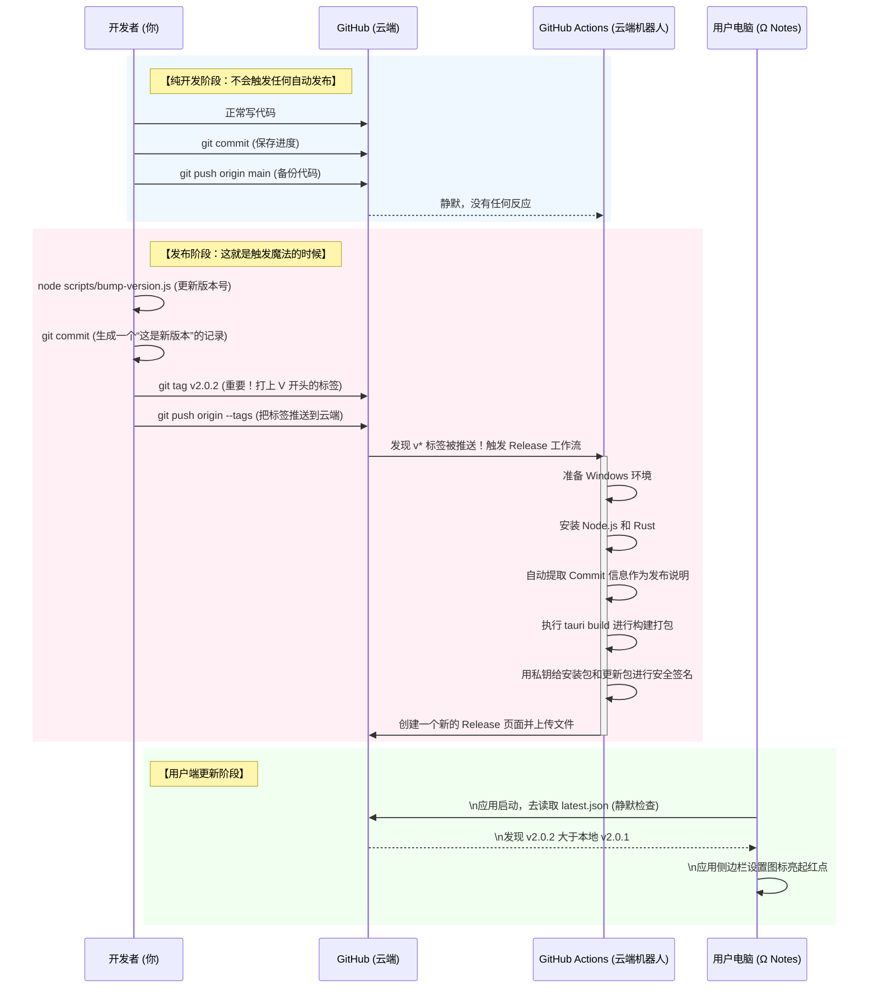
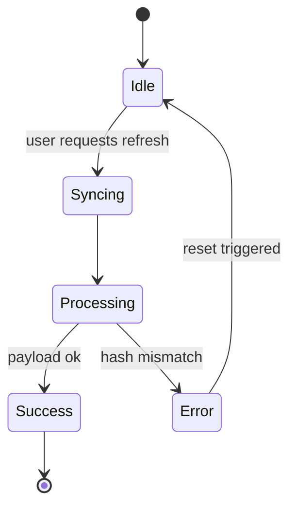

# 自动化工作流与日常开发指南

这份文档将为你解答三个核心疑惑：
1. GitHub 自动化工作流到底是怎么运作的？
2. 我的日常 `git commit` 习惯需要改变吗？
3. 如何用最好的 Prompt 让 AI 生成终极测试笔记？

> **💡 核心省流结论**
> 不管你平时敲了多少代码，提交（commit）了多少次，只要你不主动推那个叫做 `v*` 的**标签（Tag）**，就绝对**不会**触发任何自动化应用的发布。
> 而一旦你触发了标签推送，云端机器人就会自动把你上一个大版本到今天为止累积的**所有 commit 消息统统抓取过来融合成更新日志**。
> 就这么简单，你的开发习惯完全不需要改变！

---

## 一、自动化工作流是如何运作的？（带图版）

GitHub Actions 就像是一个 24 小时待命的“云端机器人”。在我们编写的 `.github/workflows/release.yml` 文件中，我们告诉了它两件事：
1. **什么时候醒来？**（触发条件）
2. **醒来之后做什么？**（执行步骤）

我们来看一下它的运作流程图：



### 解答你的疑惑：需要改掉日常的 commit 习惯吗？

**完全不需要！**

你的日常敲代码、写完一半 `git commit` 保存进度、甚至是 `git push` 到 GitHub 备份，都**绝对不会**触发自动发布。

工作流触发的唯一钥匙是：**打上了以 `v` 开头的 Tag（标签）并推送**。
如果你不执行 `git tag v...` 和 `git push --tags`，云端的机器人就永远在睡大觉。这就把你平时随意的开发和严谨的版本发布完美剥离了开来。

---

## 二、各种情景下的终端指令指南

以后你所有的命令只需要对应你当时的“心态”。

### 情景 1：我今天就随便写写，存个档防丢
不需要考虑什么规范，按照你之前的习惯来就行。
```bash
git add .
git commit -m "加了一半的悬浮球功能先存一下"
git push origin main
```
*(结果：代码会推送到 Github，供你备份并在别的电脑同步，不会有安装包发布出来)*

### 情景 2：一个功能正式做完了，我很满意
为了让之后的“自动提取更新日志”好看一点，建议套用点简单前缀（`feat:` 新功能, `fix:` 修复, `ui:` 界面调整）。
```bash
git add .
git commit -m "feat: 悬浮进度条支持拖拽吸附边缘"
git push origin main
```
*(结果：代码备份到了 Github 保存历史记录。此时依然不会触发版本发布)*

### 情景 3：我觉得攒够了功能，可以发布一版更新给用户用了
此时你要拿出《发布流程手册》那套连招了。
```bash
# 1. 把所有相关地方的版本号改为下一个版本，比如 2.0.2
node scripts/bump-version.js 2.0.2

# 2. 生成一个代表打包状态的 commit
git add .
git commit -m "chore: 发布 v2.0.2"
git push origin main

# 3. 打包发布（核心触发点！！！）
git tag v2.0.2
git push origin --tags
```
*(结果：几分钟后，群里的小伙伴就会收到更新！)*

> **🤔 重点疑问解答：那么给用户看的“更新内容（更新日志）”到底是哪里来的呢？难道只有一行“发布v2.0.2”吗？**
> 
> **不是的！** 在触发打包时，云端机器人会自动去收集从上一次发布（v2.0.1）到这次发布（v2.0.2）之间的**所有** `git commit` 信息！
> 比如你这几天写了：
> - `feat: 悬浮进度条支持边缘吸附`
> - `fix: 修复深色模式输入框看不清`
> - `ui: 调整设置页面按钮大小`
> - `chore: 发布 v2.0.2`
> 那么以上的全部内容，会被自动打包成列表，作为该版本的“更新内容”展示在应用内的更新页签上。这就意味着你平时只需稍微写好一点 commit 信息，就不用再写更新公告了。
> 
> **如果不满足机器自动抓？**
> 如果这是一次大版本更新（比如 v3.0.0），你想自己饱含感情地写一篇文笔优美的更新公告，你只需在项目最外层新建一个名为 `RELEASE_NOTES.md` 的文档，把你想写的 Markdown 丢进去。机器人只要发现有这个文件，就会**优先**读取它作为更新日志！（发完新版后把这临时文件删了即可）

### 情景 4：刚发完 2.0.2，发现有个致命的崩溃大 Bug！
不要慌，不要去撤回刚才的发布。直接修，修好后当做一个全新的小补丁版本发布。
```bash
# 修代码...
git add .
git commit -m "fix: 修复了悬浮球在超宽屏下会消失的报错"

# 发布快速补丁版 2.0.3
node scripts/bump-version.js 2.0.3
git add .
git commit -m "chore: 紧急发布 v2.0.3 修复悬浮球 Bug"
git tag v2.0.3
git push origin main --tags
```

---

## 三、如何向 AI 提问以生成终极 Markdown 测试笔记？

目前 Ω Notes 的底层编辑器（Milkdown v7）和阅读器主要能力涵盖了诸多进阶 Markdown 语法。如果你想要获得一篇高质量、能测试你软件渲染能力的笔记文本。你给 AI 的系统提示词确实需要好好讲究一下。

### 1. 明确我们要验证什么？
一篇完美的压力测试笔记应该包含：
*   **基础排版**：标题（H1-H6），粗体，斜体，删除线，区块引用。
*   **列表嵌套**：有序列表内嵌无序列表，中间穿插任务待办列表（`- [ ]` / `- [x]`）。
*   **代码支持**：行内代码以及带特定语言声明的语法高亮代码块。
*   **富媒体**：标准的图片连接插入方式。
*   **进阶扩展**：表格的渲染（斑马纹测试），**数学公式（KaTeX）**，以及**图表（Mermaid）**。

### 2. 推荐给 AI 的最终 Prompt 魔咒

下次如果需要让 AI 帮你撰写/总结内容，你想顺便利用这篇内容来测试软件的完整阅读体验，可以**随手附加上面这个模板要求**：

```text
请以此主题为我撰写一份详细指南或总结笔记。
要求：
1. 必须全程使用标准的 Markdown 语法进行层级清晰的排版。
2. 内容中需包含一个展示核心步骤的 Mermaid 流程图（sequenceDiagram或flowchart均可）。
3. 遇到代码部分，必须使用指定语言的高亮代码块（```语言名称）。
4. 遇到重要数据的对比，请用标准的 Markdown 表格形式展现。
5. 需要有一段相关的公式原理解释，并采用 KaTeX ($$ 包围的单行或多行语法) 来展示数学公式。
6. 如果涉及步骤计划，请使用待办列表结构（如 - [ ] 步骤一）。
```

### 3. 一键体验版：一份“毒瘤”测试笔记的生成

如果你现在就想直接测试一下软件是否“扛打”，你新建一个笔记，然后复制粘贴下方这个由我为你量身定做的测试流输入。

你可以创建一个空笔记专门看效果：

```markdown
# 🚀 跨越星环计划：前端构建指南

这是一份旨在完全测试阅读与编辑解析深度的样本文件。下面包含了目前系统支持的各种极端渲染用例。

## 任务执行进度与规划

下面是对今天所布置任务的一个状态抽检。我们需要按序执行并监控状态。

*   [x] 建立与云主机的握手连接
*   [ ] 核心底层依赖升级注入
    *   [ ] 检查 `@tauri-apps/api` 的版本，务必在 `v2.0` 线。
    *   [x] 处理旧项目的 `.tauri-keys.txt` 残留问题。
*   [ ] 执行全局样式注入验证

> **情报记录**：如果遭遇问题，永远记得优先查阅官方维基，或者直接跑去向 AI Code Agent 大叫。

## 图表数据与模型表现对比

在此我们统计了关于三种不同架构体系的吞吐量比对。

| 模型型号 | 单点吞吐 (QPS) | 数据丢失率 | 主要侧重点 |
| :--- | :---: | :---: | ---: |
| 猎户座 α | 1,450 | < 0.2% | 计算性能 |
| 半人马 β | 920 | 0.0% | 安全加密 |
| 仙女座 γ | 2,700 | 1.5% | 并发流量引流 |

通过对比，我们得出如下高维能量释放核心计算公式：

$$
E = mc^2 \times \int_{0}^{\infty} \frac{\sin(x)}{x} dx = \frac{\pi}{2} mc^2
$$

而在常规页面计算重排时，由于复杂 DOM，计算的时间复杂度逼近 $O(N \log N)$ 的状态。

## 系统状态流转体系展示

下面我们展示的是当前核心系统的生命周期流转。



## 核心实现代码

在这里我们将展现自动部署的 Rust 签名衍生代码：

```rust
fn main() {
    println!("Init system build...");
    
    // 我们在这里注册了一个自动重启与更新的生命周期钩子
    tauri::Builder::default()
        .plugin(tauri_plugin_process::init())
        .plugin(tauri_plugin_updater::Builder::new().build())
        .run(tauri::generate_context!())
        .expect("error while running tauri application");
}
```

所有的模块都经由 `cargo run` 指令启动测试通过。
```

> **提示**：目前你的项目中，Mermaid 可能只会当作普通代码块或需要搭配特定解析插件，数学公式（KaTeX）需要你看看之前的 Vite 插件是否配置妥当。把上面这段全部丢进你的 Ω Notes，如果是分屏模式，看右边；如果处于 WYSIWYG 模式，看它是如何立刻转化为富文本的。
